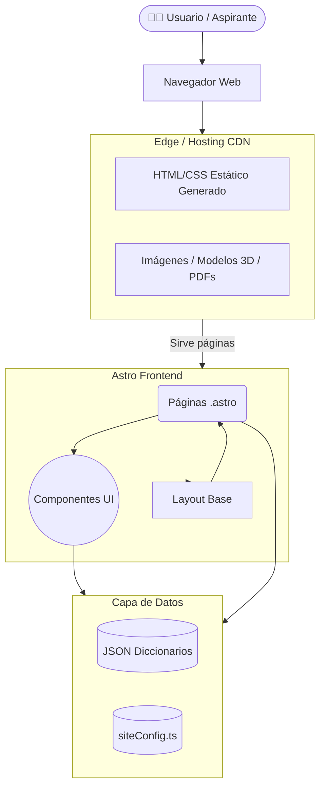
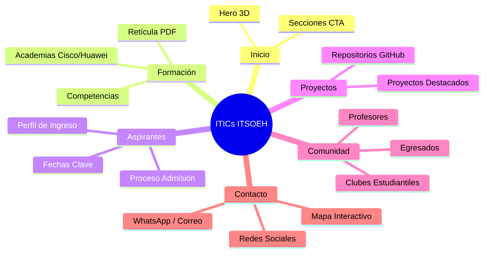
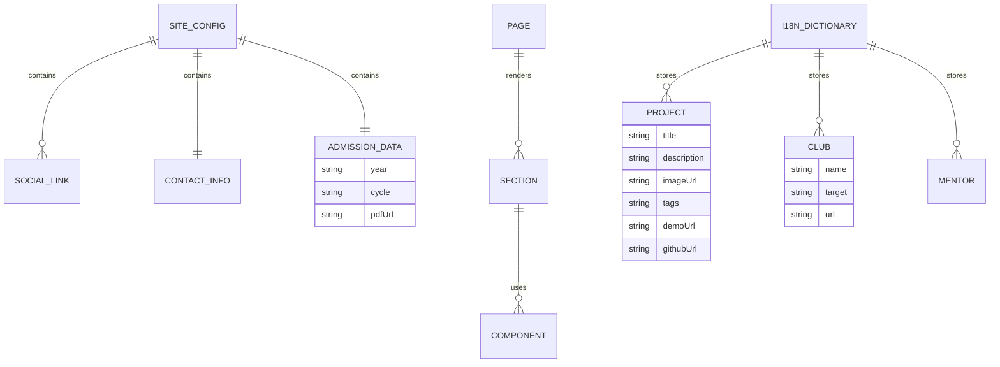

# Arquitectura y Estructura del Sitio

El sitio de **ITICs ITSOEH** está diseñado bajo los principios de **JAMstack**, utilizando [Astro](https://astro.build/) para lograr generación de sitios estáticos (SSG) de ultra alto rendimiento.

## 🏛️ Principios Arquitectónicos
1. **Zero JavaScript by Default**: El sitio envía HTML y CSS puros al cliente. El único JS cargado es el de interacciones específicas (como Three.js en el hero o el menú móvil).
2. **Single Source of Truth (SSOT)**: Configuración global, enlaces institucionales y datos de contacto se consumen desde `src/data/siteConfig.ts` para evitar la redundancia y errores de sincronización.
3. **i18n Basado en Datos**: Las páginas no contienen texto duro. Extraen diccionarios de traducciones (`src/messages/[lang]/`) permitiendo escalar a múltiples idiomas sin duplicar componentes Astro.

---

## 🗺️ Diagrama de Arquitectura General



---

## 🌐 Sitemap del Sitio



---

## 🧩 Diagrama de Componentes Principales

```mermaid
flowchart LR
    Layout[Layout.astro\nSEO & Wrapper] --> Nav[Navbar.astro]
    Layout --> Footer[Footer.astro]
    Layout --> PageContent((Contenido de la Página))

    PageContent --> Hero[Hero.astro]
    PageContent --> Models[Model3DCanvas.astro]
    
    Footer --> Config[siteConfig.ts\n(Links y Teléfonos)]
    Nav --> NavData[navigation.ts\n(Rutas)]
    
    subgraph Patrones de UI en Páginas
        PageContent -.-> FeatureCard[Tarjetas de Información]
        PageContent -.-> CTASection[Llamados a la Acción]
        PageContent -.-> LogoStrip[Cintas de Logos]
    end
```

---

## 💾 Modelo de Datos Conceptual
Aunque no hay una base de datos tradicional, el sitio maneja "Entidades" a nivel de archivos de configuración (`.json` y `.ts`).


