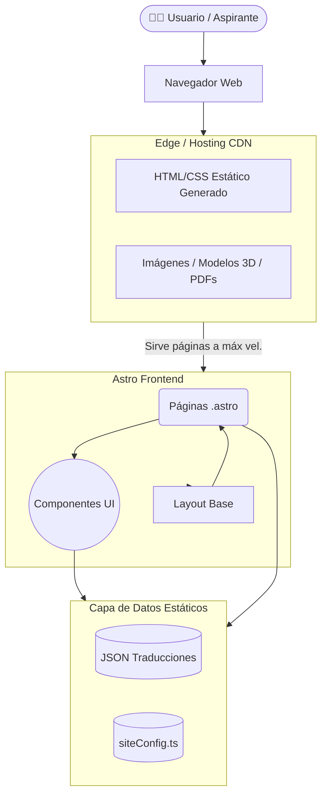
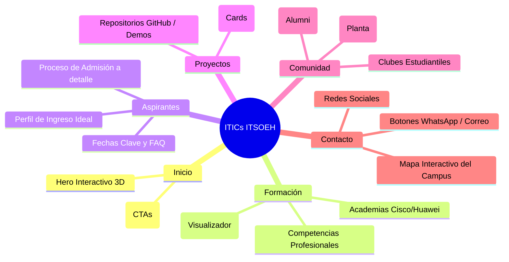
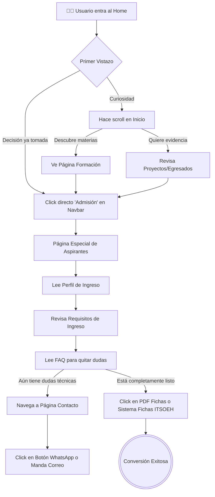
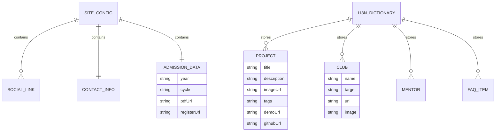
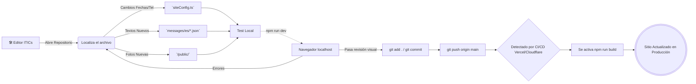

# Diagramas del Sistema

Esta sección consolida todos los gráficos y flujos operativos que describen cómo interactúan los usuarios con la información y cómo está ensamblado el sitio a nivel de módulos. Estos diagramas son generados automáticamente en GitHub usando la tecnología **Mermaid**.

---

## 1. Diagrama de Arquitectura (Frontend a Servidor)
Demuestra el ciclo desde que un aspirante entra al navegador hasta que nuestro sitio estático (SSG) extrae sus JSONs y sirve la vista terminada.



---

## 2. Sitemap del Sitio ITICs ITSOEH
Muestra las seis ramificaciones estructurales principales a las que un aspirante o empresa tiene acceso desde el Navbar superior.



---

## 3. Diagrama de Composición (Component Tree)
Indica qué componente maestro es padre de cuáles otros sub-componentes.

```mermaid
flowchart LR
    Layout[Layout.astro\n(SEO, Metadatos, Base CSS)] --> Nav[Navbar.astro]
    Layout --> Footer[Footer.astro]
    Layout --> SiteLoader[SiteLoader.astro]
    Layout --> PageContent((Contenido de la Página .astro))

    PageContent --> Hero[Hero.astro\n(Homepage)]
    PageContent --> CTAS[CTABanners]
    
    Hero --> Models[Model3DCanvas.astro\nLazy-loaded Three.js]
    
    Footer -.-> |Lee Redes Sociales de| Config[siteConfig.ts]
    Nav -.-> |Lee Rutas de| NavData[navigation.ts]
```

---

## 4. Flujo del Usuario Aspirante (Conversión)
El sitio tiene un objetivo de negocio: Informar de tal manera que un estudiante de prepa elija estudiar ITICs e inicie su proceso de inscripción ("Conversión Exitosa").



---

## 5. Modelo de Datos Conceptual
Aunque JAMstack se basa en archivos (no hay Base de Datos MySQL), el código maneja un modelo de dominio fuertemente estructurado.



---

## 6. Flujo de Mantenimiento de Contenido para Desarrolladores
Pasos que sigue el mantenedor oficial del sitio (Servicio Social / Coordinador).


