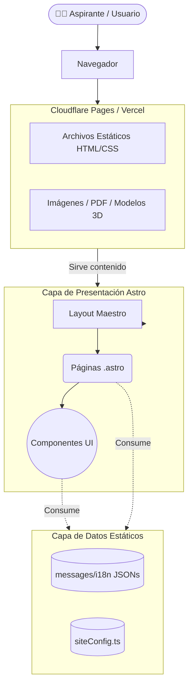
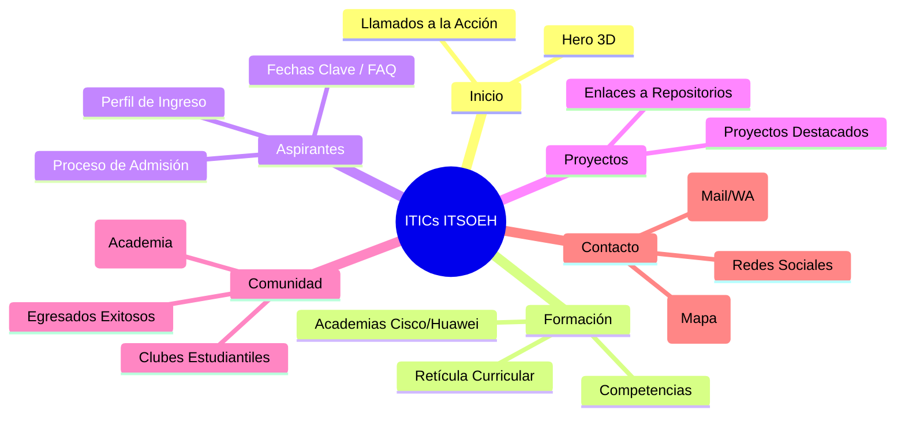
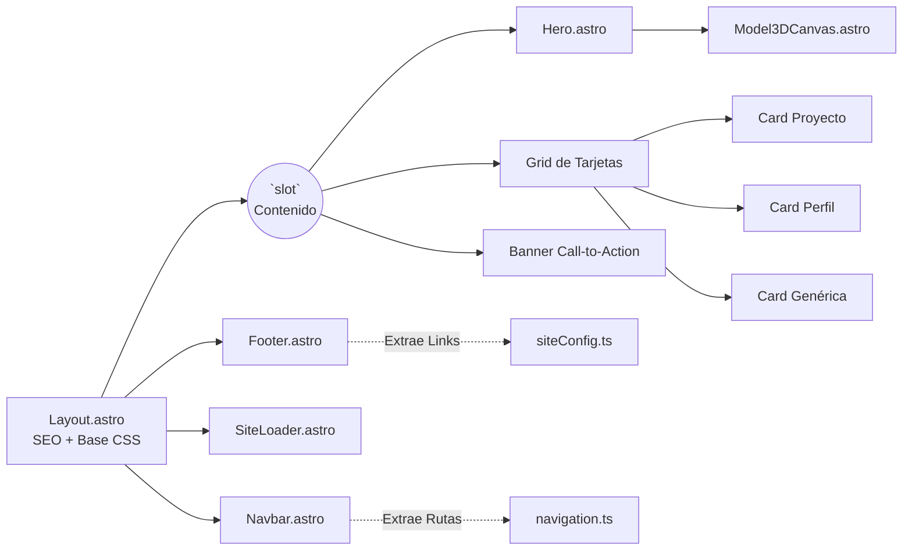
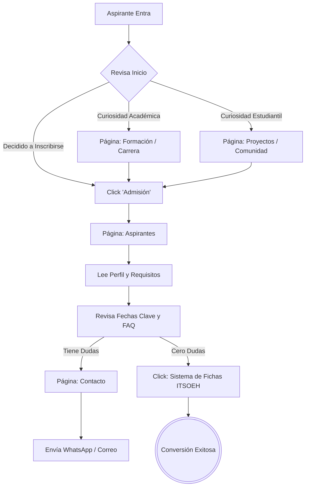
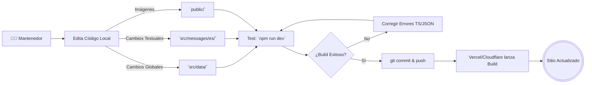
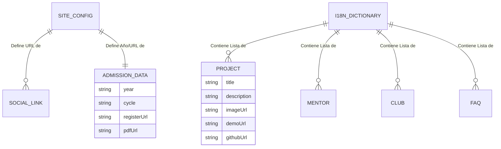
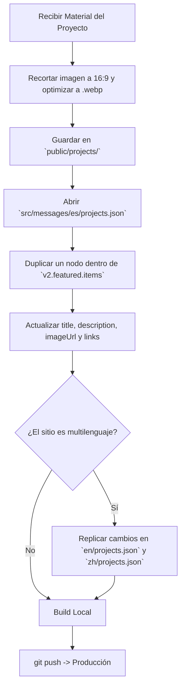
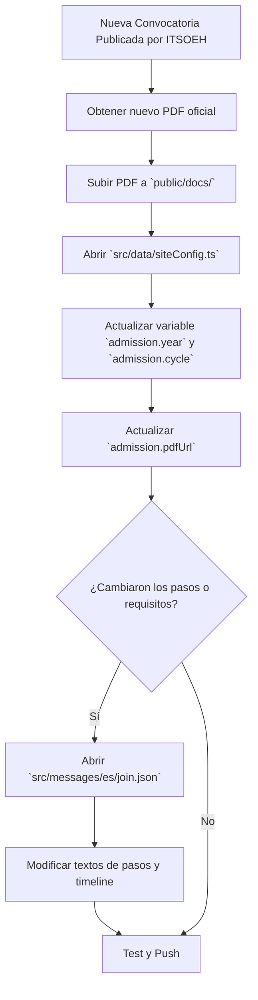
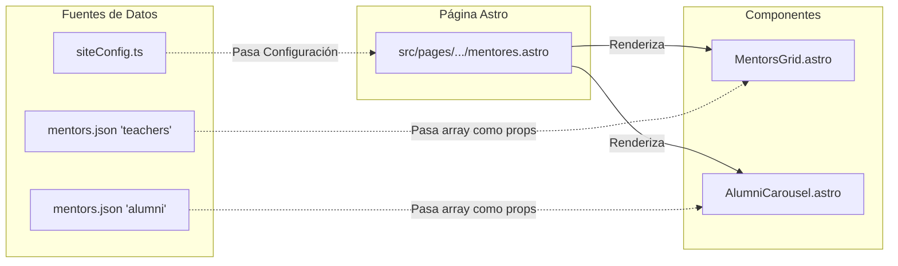

# Colección de Diagramas del Sistema

Esta sección proporciona una representación visual integral del sitio web de ITICs ITSOEH. Todos los diagramas están construidos con [Mermaid](https://mermaid.js.org/) para asegurar su renderizado automático en GitHub, Notion y otras herramientas compatibles con Markdown.

---

## 1. Arquitectura General
*Representa la vista de alto nivel del sistema JAMstack, desde el usuario hasta los datos subyacentes.*

**Explicación:** El sitio no posee base de datos tradicional ni servidor activo (Node/PHP). En su lugar, Astro genera archivos HTML planos estáticos durante el proceso de *build*, inyectando la información desde la capa de configuración (DataLayer).

---

## 2. Sitemap Estructural
*Muestra la jerarquía de navegación y las ramificaciones principales del sitio.*

**Explicación:** La estructura está optimizada para guiar a los aspirantes. Mantiene la profundidad de clics al mínimo, asegurando que la información de admisión y contacto sea accesible desde cualquier nivel del árbol.

---

## 3. Árbol de Componentes Reutilizables
*Mapea la relación padre-hijo entre los bloques de construcción de la interfaz gráfica.*

**Explicación:** `Layout.astro` actúa como el *App Shell* o marco de todas las páginas, inyectando el SEO y las dependencias globales. Dentro del `<slot>`, las páginas ensamblan vistas usando componentes "tontos" y reutilizables.

---

## 4. Flujo del Usuario Aspirante (Conversión)
*Ruta esperada que recorre un prospecto desde que entra hasta que se inscribe.*

**Explicación:** El diseño sigue una lógica de embudo (Funnel). Cada página del sitio tiene como objetivo final redirigir al estudiante hacia el flujo de admisión o resolución de dudas de contacto.

---

## 5. Flujo General de Mantenimiento de Contenido
*Ciclo de vida para actualizar la información sin arriesgar la plataforma.*

**Explicación:** Se prioriza un desarrollo defensivo. Al usar `npm run build` localmente, Astro verificará que todas las llaves JSON existan y que no haya enlaces rotos antes de impactar producción.

---

## 6. Modelo Conceptual de Datos
*Estructura de las entidades de información, aunque no exista una base de datos real.*

**Explicación:** Demuestra cómo las entidades "entran" al sistema. Mientras que los proyectos, clubes y mentores viven en diccionarios de traducciones (i18n), la configuración dura (fechas, links de registro) vive centralizada en la configuración.

---

## 7. Flujo de Actualización de Proyectos
*Protocolo estricto para agregar un nuevo proyecto estudiantil.*

**Explicación:** Subraya la importancia crítica de la optimización de imágenes (WebP) y la obligación arquitectónica de replicar las llaves en los otros archivos de idiomas para evitar rupturas de Astro.

---

## 8. Flujo de Actualización de Admisión (Cambio de Ciclo)
*Protocolo para el salto anual de ciclo escolar (Ej. 2026 -> 2027).*

**Explicación:** Desvincula la actualización de variables "duras" (año, ciclo) de los textos narrativos de la convocatoria, centralizando los links en TypeScript (`siteConfig`) y no en archivos Astro.

---

## 9. Relación de Simbiosis: Páginas, Secciones y Datos
*Muestra cómo la vista web, el componente parcial y el JSON se unen en la pantalla del usuario final.*

**Explicación:** Describe el flujo de datos unidireccional. La Página actúa como controlador: extrae la información del JSON y de SiteConfig, y la pasa "hacia abajo" a los componentes en forma de propiedades (props) para ser renderizadas.
