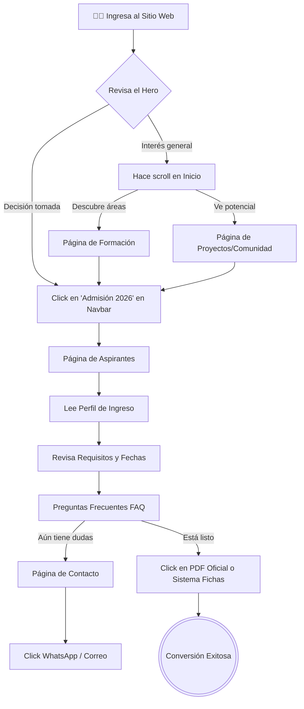
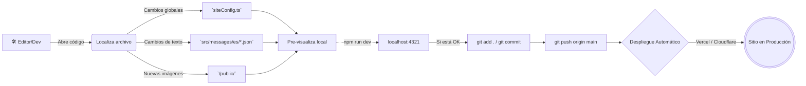

# Flujos de Operación y Mantenimiento

Esta documentación mapea el recorrido principal de los usuarios y el proceso técnico para mantener el sitio.

## 🚶‍♂️ Flujo del Usuario Aspirante (Embudo de Conversión)
El sitio está diseñado para que un aspirante de preparatoria tenga un camino claro desde el descubrimiento hasta el contacto.

---

## 💻 Flujo de Mantenimiento de Contenido
Para futuros administradores o desarrolladores, este es el flujo para modificar la información del sitio (como agregar un profesor o actualizar fechas de fichas).

